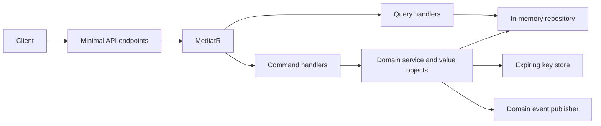
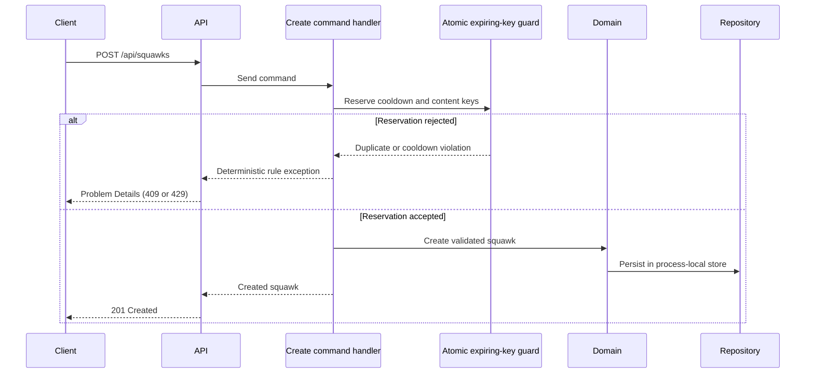

# ParrotInc SquawkService

[](https://github.com/andreluizleite/ParrotInc.SquawkService/actions/workflows/ci.yml)
[](https://dotnet.microsoft.com/)
[](https://github.com/andreluizleite/ParrotInc.SquawkService/releases/latest)
[](LICENSE)

A focused .NET service that demonstrates how deterministic business rules, CQRS, domain modeling, and concurrency-safe in-memory infrastructure can work together without unnecessary distributed-system complexity.

The fictional ParrotInc platform allows users to publish short messages called **squawks**.

## Business rules

- Content is required and is trimmed before persistence.
- A squawk can contain at most 400 characters.
- The terms `Tweet` and `Twitter` are restricted, case-insensitively.
- The same user must wait 20 seconds between different squawks.
- The same user cannot submit the same normalized content within 24 hours.
- Rule violations are deterministic and return stable error codes through Problem Details.

These rules are enforced in the domain and infrastructure boundary, not delegated to controllers or an AI model.

## Technical highlights

- .NET 10 and ASP.NET Core Minimal APIs
- Domain-oriented model with value objects and explicit rule exceptions
- CQRS request handling with MediatR
- Thread-safe in-memory repository and expiring key store
- Atomic duplicate and per-user cooldown reservations
- Deterministic, testable domain-event publication
- RFC 9457-style Problem Details responses
- API-level abuse protection with ASP.NET Core rate limiting
- Health check endpoint
- Unit and in-process API integration tests
- Central NuGet package management and dependency lock files
- Docker and GitHub Actions CI
- Dependabot dependency automation

## Architecture



The repository and expiring key store are registered as singletons intentionally. They represent the process-local infrastructure of this sample and preserve state across HTTP requests.

### Concurrency-safe creation flow



The reservation is atomic: concurrent requests from the same user cannot both pass the duplicate and cooldown checks. In a multi-instance deployment, this guard would move to a shared store such as Redis while the deterministic rule contract remained unchanged.

## API

### Create a squawk

```http
POST /api/squawks
Content-Type: application/json

{
  "userId": "1a9a269d-a6b9-4e22-9f99-b56283e7fe21",
  "content": "A short engineering note."
}
```

Successful requests return `201 Created` and a location header for the new resource.

### List squawks

```http
GET /api/squawks
```

### Get a squawk by identifier

```http
GET /api/squawks/{squawkId}
```

### Health check

```http
GET /health/live
```

## Error contract

Domain-rule failures use Problem Details and include a stable `code` field:

| Code | HTTP status | Meaning |
| --- | ---: | --- |
| `content_required` | 400 | Content was empty |
| `content_too_long` | 400 | Content exceeded 400 characters |
| `restricted_content` | 400 | Content included a restricted term |
| `user_required` | 400 | The user identifier was empty |
| `duplicate_squawk` | 409 | Duplicate content inside the 24-hour window |
| `posting_too_fast` | 429 | The per-user 20-second cooldown is active |

The `posting_too_fast` response also includes `Retry-After: 20`.

## Run locally

Prerequisites:

- .NET 10 SDK

```powershell
dotnet restore SquawkService.sln
dotnet run --project SquawkService/API/ParrotInc.SquawkService.API.csproj
```

Open `http://localhost:5194/swagger`.

## Run with Docker

```powershell
docker build -t parrotinc-squawk-service .
docker run --rm -p 8080:8080 parrotinc-squawk-service
```

Open `http://localhost:8080/swagger`.

## Tests

```powershell
dotnet test SquawkService.sln --configuration Release
```

The test suite covers content invariants, duplicate detection, cooldown expiration, persistence, event publication, CQRS HTTP flows, Problem Details, and health checks.

## Scope and trade-offs

This is an intentionally small portfolio service. It uses in-memory adapters so another developer can run it immediately without provisioning infrastructure.

For a multi-instance production deployment, the repository and expiring key store would be replaced with persistent and distributed adapters, such as PostgreSQL and Redis. Reliable external event delivery would also require an outbox and a message broker. Those components are described as evolution paths rather than simulated with incomplete abstractions.
